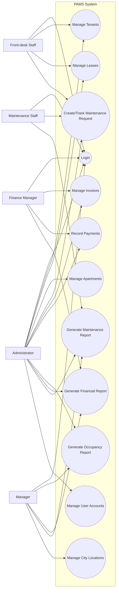
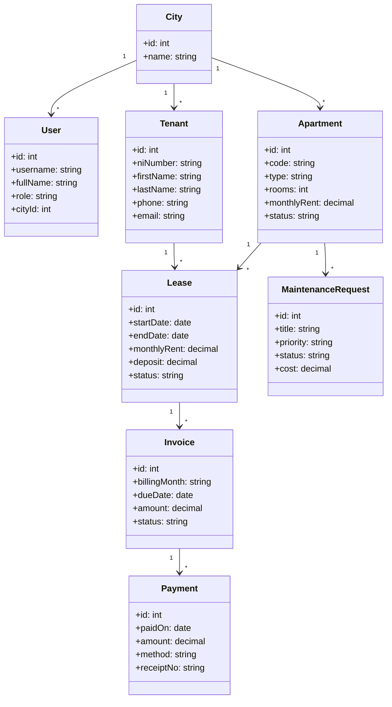
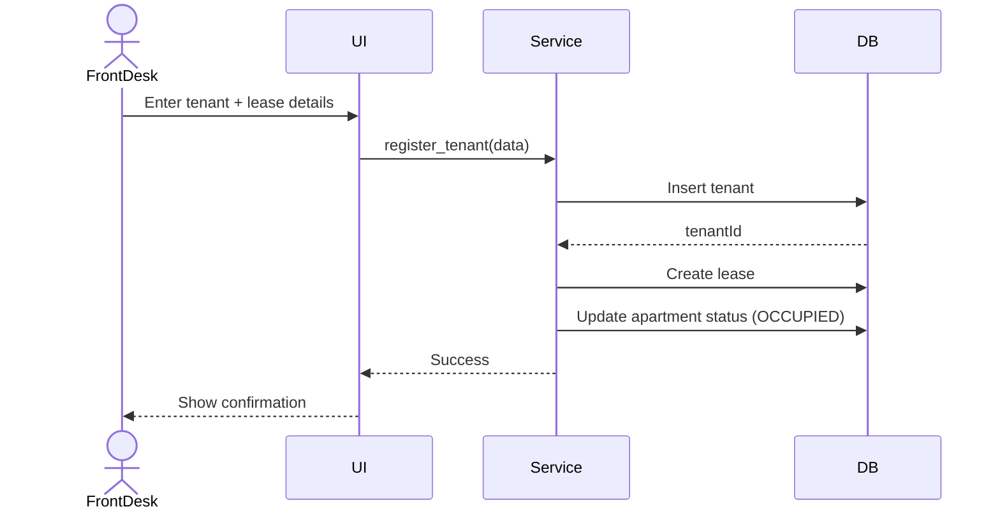
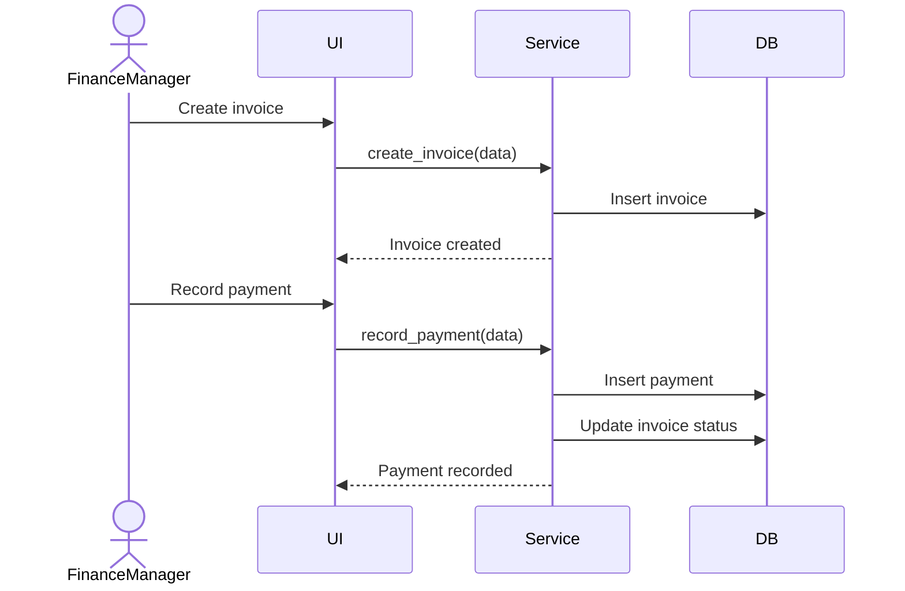
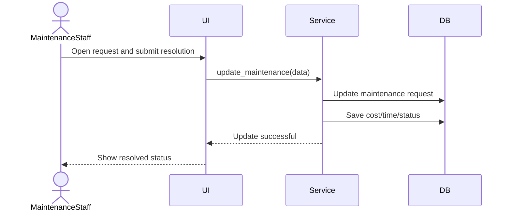

# Simple Final Diagram Set (Spec-Focused)

This set is intentionally minimal and matches what the brief asks for:
- 1 Use Case diagram
- 1 Class diagram
- 3 Sequence diagrams

## 1) Use Case Diagram

## 2) Class Diagram

## 3) Sequence Diagram: Register Tenant + Lease

## 4) Sequence Diagram: Invoice + Payment

## 5) Sequence Diagram: Resolve Maintenance Request

