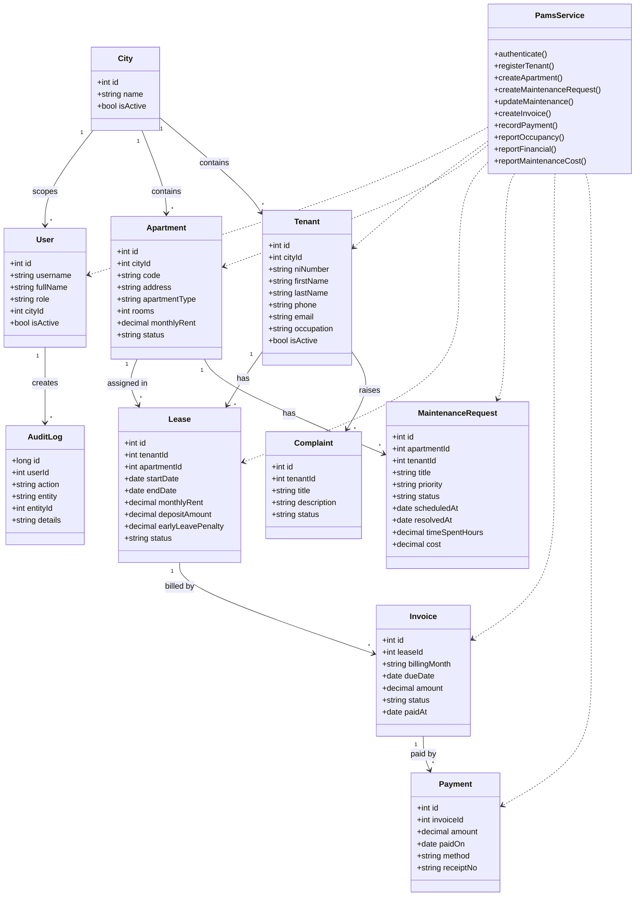
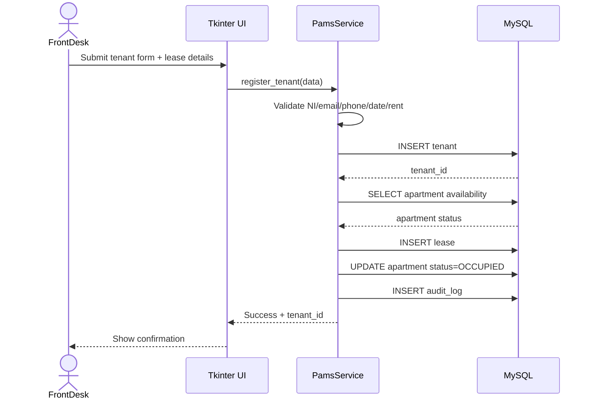
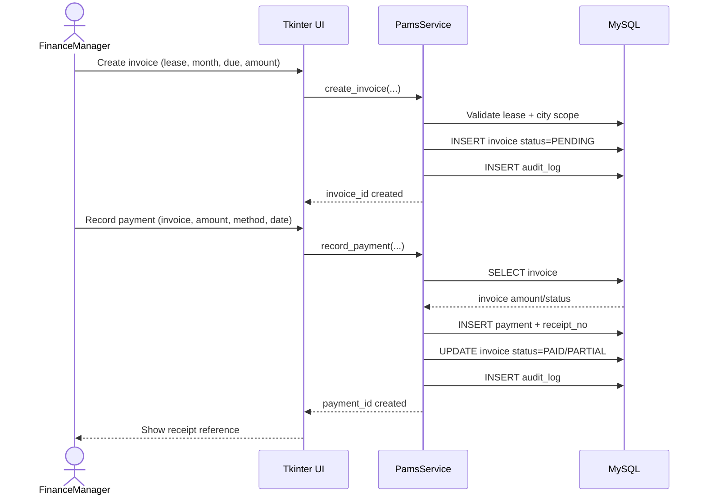
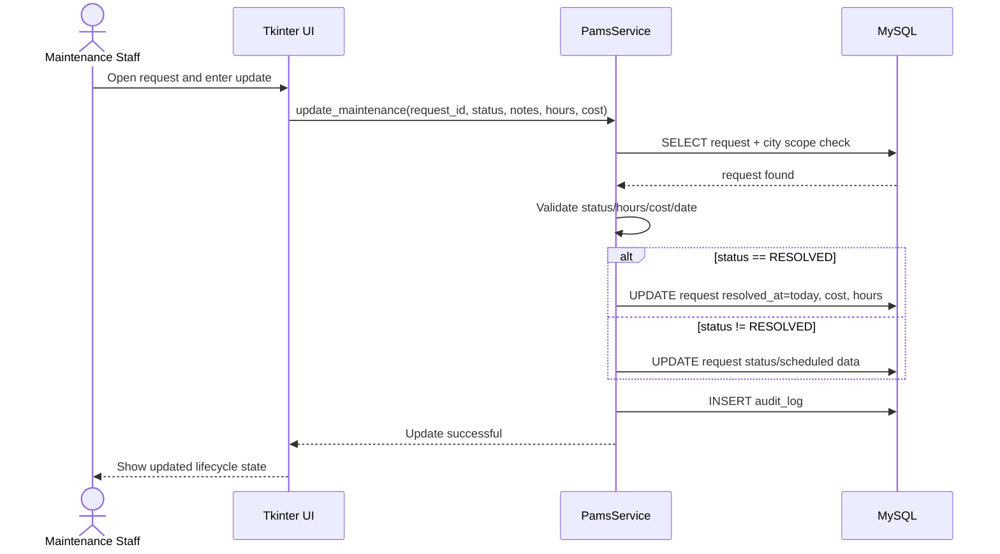

# Visual Diagram Pack (Draft)

These are visual drafts you can view directly in Markdown (Mermaid-rendered).

## 1) Use Case Diagram

```mermaid
flowchart LR
    FD[Front-desk Staff]
    FM[Finance Manager]
    MS[Maintenance Staff]
    AD[Administrator (City)]
    MG[Manager (All Cities)]

    subgraph SYS["Paragon Apartment Management System (PAMS)"]
        UC0((Authenticate User))
        UC1((Register / Update Tenant))
        UC2((Track Lease Agreements))
        UC3((Request Early Leave))
        UC4((Log Complaint))
        UC5((Register Apartment))
        UC6((Assign Apartment / Track Occupancy))
        UC7((Create Maintenance Request))
        UC8((Schedule / Resolve Maintenance))
        UC9((Create Invoice))
        UC10((Record Payment))
        UC11((Mark Late Payments))
        UC12((Generate Occupancy Report))
        UC13((Generate Financial Summary))
        UC14((Generate Maintenance Cost Report))
        UC15((Manage User Accounts))
        UC16((Add / Manage City Locations))
    end

    FD --> UC0
    FD --> UC1
    FD --> UC2
    FD --> UC4
    FD --> UC7

    FM --> UC0
    FM --> UC9
    FM --> UC10
    FM --> UC11
    FM --> UC13

    MS --> UC0
    MS --> UC8
    MS --> UC14

    AD --> UC0
    AD --> UC1
    AD --> UC2
    AD --> UC5
    AD --> UC6
    AD --> UC7
    AD --> UC8
    AD --> UC9
    AD --> UC10
    AD --> UC12
    AD --> UC13
    AD --> UC14
    AD --> UC15
    AD --> UC3

    MG --> UC0
    MG --> UC12
    MG --> UC13
    MG --> UC14
    MG --> UC16
```

## 2) Class Diagram



## 3) Sequence Diagram A: Register Tenant + Lease Assignment



## 4) Sequence Diagram B: Create Invoice + Record Payment



## 5) Sequence Diagram C: Resolve Maintenance Request



